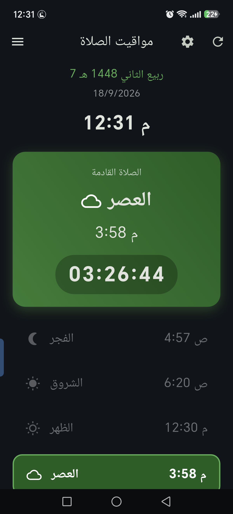
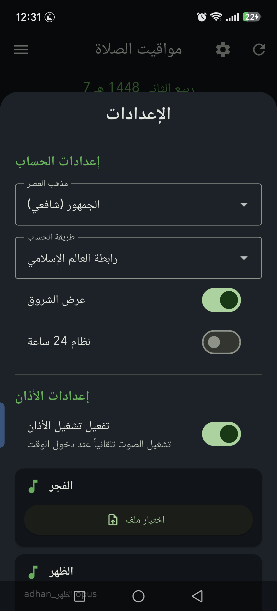

<div dir="rtl" align="right">

# 🕌 مواقيت الصلاة — Prayer Timer

تطبيق Flutter لمواقيت الصلاة بدقة حسب موقعك، مع تشغيل الأذان تلقائياً بوقته بصوت تختاره لكل صلاة، حتى لو كان التطبيق مغلقاً.

<p align="center">
  
  &nbsp;
  
  &nbsp;
  
</p>

## ✨ المميزات

- **مواقيت دقيقة:** حساب الفجر والشروق والظهر والعصر والمغرب والعشاء اعتماداً على موقعك عبر GPS.
- **الصلاة القادمة:** بطاقة بعدّاد تنازلي حي، مع التاريخ الهجري والميلادي.
- **طرق حساب متعددة:** رابطة العالم الإسلامي، الهيئة المصرية، كراتشي، أم القرى، دبي، قطر، الكويت، تركيا.
- **مذهب العصر:** الجمهور (شافعي) أو الحنفي.
- **أذان تلقائي بالخلفية:** خدمة تعمل بالمقدمة (Foreground Service) تشغّل الأذان بوقته بعد إغلاق التطبيق، وتعود للعمل بعد إعادة تشغيل الهاتف.
- **صوت مخصص لكل صلاة:** اختر أي ملف صوتي لكل صلاة على حدة، مع معاينة قبل الحفظ.
- **تحكم بالصوت لكل صلاة:** شريط مستقل لمستوى الصوت لكل صلاة. يعمل الأذان على قناة المنبّه ليُسمع حتى لو كان صوت الوسائط منخفضاً.
- **إشعار وقت الصلاة:** يظهر إشعار عند دخول الوقت.
- **خيارات العرض:** نظام 24 ساعة، وإظهار الشروق أو إخفاؤه.
- **واجهة داكنة عربية** بالكامل (RTL).

## 🧱 التقنيات

| الجانب | المكتبة |
| --- | --- |
| حساب المواقيت | [`adhan_dart`](https://pub.dev/packages/adhan_dart) |
| الموقع | [`geolocator`](https://pub.dev/packages/geolocator) |
| الخدمة بالخلفية | [`flutter_background_service`](https://pub.dev/packages/flutter_background_service) |
| تشغيل الصوت | [`just_audio`](https://pub.dev/packages/just_audio) + [`audio_session`](https://pub.dev/packages/audio_session) |
| الإشعارات | [`flutter_local_notifications`](https://pub.dev/packages/flutter_local_notifications) |
| الصلاحيات | [`permission_handler`](https://pub.dev/packages/permission_handler) |
| الإعدادات المحفوظة | [`shared_preferences`](https://pub.dev/packages/shared_preferences) |
| اختيار الملفات | [`file_picker`](https://pub.dev/packages/file_picker) |
| التاريخ الهجري | [`hijri`](https://pub.dev/packages/hijri) |

## 🗂️ هيكل المشروع

```
lib/
├── main.dart                     # نقطة الدخول وتهيئة الخدمات
├── models/                       # AppSettings, PrayerItem
├── screens/                      # الشاشة الرئيسية وصفحات القائمة الجانبية
├── services/
│   ├── prayer_service.dart       # حساب المواقيت
│   ├── location_service.dart     # تحديد الموقع
│   ├── adhan_service.dart        # تشغيل ومعاينة الأذان داخل التطبيق
│   ├── background_service.dart   # خدمة الأذان بالخلفية
│   ├── notification_service.dart # إشعارات وقت الصلاة
│   └── permission_service.dart   # صلاحيات البطارية والتنبيهات
├── utils/                        # الثوابت وتنسيق الوقت
└── widgets/                      # مكوّنات الواجهة (القائمة الجانبية، الإعدادات ...)
```

## 🚀 التشغيل

المتطلبات: Flutter (Dart `^3.12`) وجهاز أو محاكي Android.

```bash
git clone <رابط-المستودع>
cd prayer_timer
flutter pub get
flutter run
```

لبناء نسخة للتثبيت:

```bash
flutter build apk --release
```

## 🔔 ضمان عمل الأذان والتطبيق مغلق

عند أول تشغيل يطلب التطبيق الصلاحيات التالية. يُفضّل قبولها كلها:

1. **الموقع** لحساب المواقيت.
2. **الإشعارات** لإظهار تنبيه وقت الصلاة.
3. **التنبيهات الدقيقة (Alarms & reminders)**.
4. **تجاهل تحسين البطارية** لمنع النظام من إيقاف الخدمة.

بعض الأجهزة (Honor، Huawei، Xiaomi، Oppo، Samsung) تقيّد التطبيقات بالخلفية بشكل إضافي. إن لم يعمل الأذان:

- افتح **إعدادات الهاتف ← التطبيقات ← مواقيت الصلاة ← البطارية**، وفعّل **التشغيل التلقائي** و**التشغيل بالخلفية**، واجعل الاستهلاك **غير مقيّد**.
- ارفع **صوت المنبّه** من إعدادات الهاتف، فالأذان يتبع مستواه.
- افتح التطبيق مرة واحدة على الأقل بعد التثبيت ليحفظ موقعك، فالخدمة تعتمد عليه لحساب الأوقات.

## 🛠️ ملاحظات تقنية

- الخدمة تحسب المواقيت من آخر موقع محفوظ وإعدادات المذهب وطريقة الحساب، وتراقب الوقت كل ثانية.
- تظهر في الخدمة إشعار دائم منخفض الأهمية، وهو شرط من أندرويد لتبقى الخدمة حيّة.
- الدعم الحالي لنظام **Android** فقط.

## 📄 الترخيص

لم يُحدَّد ترخيص بعد. أضف ملف `LICENSE` حسب رغبتك.

</div>
